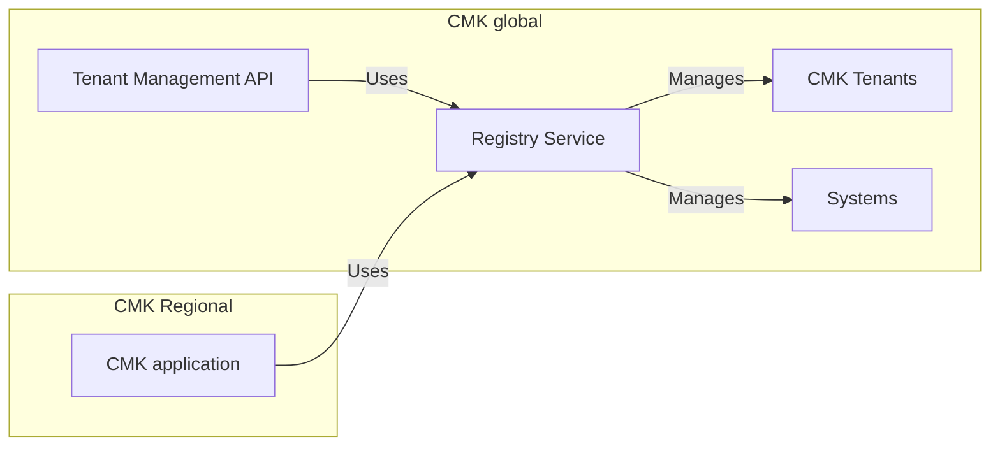

# Registry service

## Purpose

Registry service is the central data management service for the CMK landscape. It manages CMK tenants and systems.

## Description

Registry service is part of the global CMK layer and is responsible for managing the following CMK resources:

### Tenants
The tenant resource holds information about CMK tenants like owner id and type and region.
It is used by
* The Tenant Management API to create, block and terminate tenants
* The regional CMK layer to implement the tenant lifecycle used by the CMK application

### Systems
Systems are all customer-exposed business tenants of any kind.
The systems resource holds information about the system, the kernel service region and key assignment information.
It is used by
* The Kernel Services to announce or terminate systems
* The CMK application to manage information about the systems and their key assignment.

# OpenKCM: Our new open source project

## About this project

*Insert a short description of your project here...*

## Requirements and Setup

*Insert a short description what is required to get your project running...*

## Support, Feedback, Contributing

This project is open to feature requests/suggestions, bug reports etc. via [GitHub issues](https://github.com/openkcm/registry/issues). Contribution and feedback are encouraged and always welcome. For more information about how to contribute, the project structure, as well as additional contribution information, see our [Contribution Guidelines](CONTRIBUTING.md).

## Security / Disclosure
If you find any bug that may be a security problem, please follow our instructions at [in our security policy](https://github.com/openkcm/registry/security/policy) on how to report it. Please do not create GitHub issues for security-related doubts or problems.

## Code of Conduct

We as members, contributors, and leaders pledge to make participation in our community a harassment-free experience for everyone. By participating in this project, you agree to abide by its [Code of Conduct](https://github.com/openkcm/.github/blob/main/CODE_OF_CONDUCT.md) at all times.

## Licensing

Copyright (20xx-)20xx SAP SE or an SAP affiliate company and OpenKCM contributors. Please see our [LICENSE](LICENSE) for copyright and license information. Detailed information including third-party components and their licensing/copyright information is available [via the REUSE tool](https://api.reuse.software/info/github.com/openkcm/registry).
